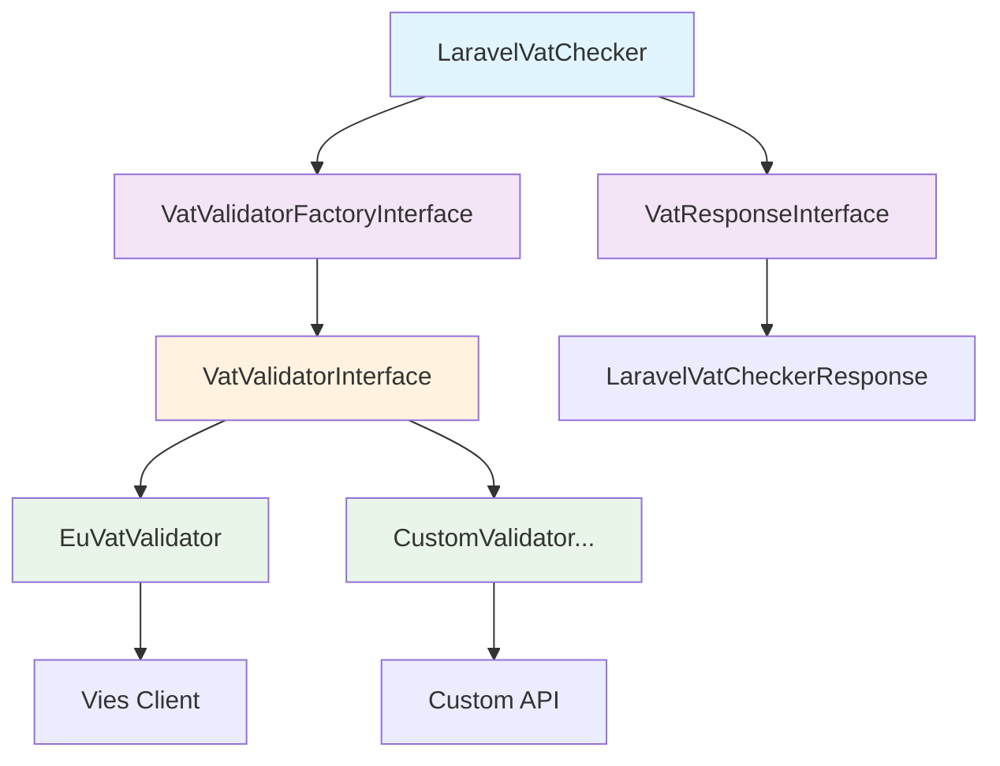

# Laravel VAT Checker

[](https://packagist.org/packages/alegiac/laravel-vat-checker)
[](https://packagist.org/packages/alegiac/laravel-vat-checker)


A flexible, extensible VAT number validation package for Laravel. Originally designed for European VAT numbers, now supports easy extension to any country with a clean, SOLID architecture.

## Features

- ✅ **European VAT validation** with VIES integration
- ✅ **Format validation** for all EU countries
- ✅ **Extensible architecture** for non-EU countries
- ✅ **SOLID principles** - Clean, maintainable code
- ✅ **Backward compatible** - No breaking changes
- ✅ **Laravel integration** with Facade and Service Provider
- ✅ **Dependency injection** ready

## Installation

You can install the package via composer:

```bash
composer require alegiac/laravel-vat-checker
```

## Basic Usage

### Using the Facade (Recommended)

```php
use LaravelVatChecker;

$result = LaravelVatChecker::check('IT12345678901');

// Result structure:
// [
//     'isFormatted' => true,    // Format validation result
//     'isVies' => true,         // External validation result
//     'details' => [...]        // Additional validation details
// ]
```

### Using the Class Directly

```php
use Alegiac\LaravelVatChecker\LaravelVatChecker;

$checker = new LaravelVatChecker();
$result = $checker->check('DE123456789');
```

## Supported Countries

The package currently supports all EU countries:

- **AT** (Austria), **BE** (Belgium), **BG** (Bulgaria)
- **CY** (Cyprus), **CZ** (Czech Republic), **DE** (Germany)
- **DK** (Denmark), **EE** (Estonia), **EL** (Greece)
- **ES** (Spain), **FI** (Finland), **FR** (France)
- **HR** (Croatia), **HU** (Hungary), **IE** (Ireland)
- **IT** (Italy), **LT** (Lithuania), **LU** (Luxembourg)
- **LV** (Latvia), **MT** (Malta), **NL** (Netherlands)
- **PL** (Poland), **PT** (Portugal), **RO** (Romania)
- **SE** (Sweden), **SI** (Slovenia), **SK** (Slovakia)

## Extending for Non-EU Countries

The package is designed to be easily extensible. Here's how to add support for other countries:

### 1. Create a Custom Validator

```php
use Alegiac\LaravelVatChecker\Contracts\VatValidatorInterface;

class CustomCountryVatValidator implements VatValidatorInterface
{
    public function supports(string $countryCode): bool
    {
        return $countryCode === 'XX'; // Your country code
    }

    public function validateFormat(string $vatNumber): bool
    {
        // Implement your country's VAT validation logic
        return preg_match('/^XX\d{9}$/', $vatNumber) > 0;
    }

    public function validateExternal(string $vatNumber): array
    {
        // Integrate with your country's tax authority API
        return [
            'valid' => true,
            'countryCode' => 'XX',
            'vatNumber' => $vatNumber,
            'name' => 'Company Name',
            'address' => 'Company Address',
        ];
    }

    public function extractCountryCode(string $vatNumber): string
    {
        return 'XX';
    }

    public function cleanVatNumber(string $vatNumber): string
    {
        return strtoupper(trim($vatNumber));
    }
}
```

### 2. Register the Validator

```php
use Alegiac\LaravelVatChecker\LaravelVatChecker;
use Alegiac\LaravelVatChecker\Validators\CustomCountryVatValidator;

$checker = new LaravelVatChecker();
$checker->registerValidator(new CustomCountryVatValidator());

// Now you can validate your country's VAT numbers
$result = $checker->check('XX123456789');
```

### 3. Using with Laravel Service Container

In your `AppServiceProvider`:

```php
use Alegiac\LaravelVatChecker\Contracts\VatValidatorFactoryInterface;
use Alegiac\LaravelVatChecker\Validators\CustomCountryVatValidator;

public function boot()
{
    $factory = app(VatValidatorFactoryInterface::class);
    $factory->registerValidator(new CustomCountryVatValidator());
}
```

## Advanced Usage

### Get Supported Countries

```php
$checker = new LaravelVatChecker();
$countries = $checker->getSupportedCountries();
// Returns: ['AT', 'BE', 'BG', 'CY', 'CZ', 'DE', ...]
```

### Check Country Support

```php
$checker = new LaravelVatChecker();
$isSupported = $checker->isCountrySupported('IT'); // true
$isSupported = $checker->isCountrySupported('XX'); // false
```

### Dependency Injection

```php
use Alegiac\LaravelVatChecker\Contracts\VatValidatorFactoryInterface;
use Alegiac\LaravelVatChecker\Contracts\VatResponseInterface;

class MyService
{
    public function __construct(
        private VatValidatorFactoryInterface $validatorFactory,
        private VatResponseInterface $response
    ) {}

    public function validateVat(string $vatNumber): array
    {
        // Custom validation logic using injected dependencies
    }
}
```

## Architecture

The package follows SOLID principles:

- **Single Responsibility**: Each class has one clear purpose
- **Open/Closed**: Easy to extend without modifying existing code
- **Liskov Substitution**: All validators are interchangeable
- **Interface Segregation**: Clean, focused interfaces
- **Dependency Inversion**: Depends on abstractions, not concretions

### Architecture Diagram



### Key Components

- `VatValidatorInterface`: Contract for all validators
- `VatValidatorFactoryInterface`: Factory for creating validators
- `VatResponseInterface`: Response structure contract
- `EuVatValidator`: European VAT validation implementation
- `LaravelVatChecker`: Main service class

## Migration from Previous Versions

**No changes required!** The package maintains full backward compatibility. Your existing code will continue to work exactly as before:

```php
// This still works exactly as before
$result = LaravelVatChecker::check('IT12345678901');
```

The refactored code provides the same API while offering a much more extensible and maintainable architecture.

### Testing

```bash
composer test
```

### Changelog

Please see [CHANGELOG](CHANGELOG.md) for more information what has changed recently.

## Contributing

Please see [CONTRIBUTING](CONTRIBUTING.md) for details.

### Security

If you discover any security related issues, please email alessandro.giacomella@gmail.com instead of using the issue tracker.

## Credits

-   [Alessandro GIacomella](https://github.com/alegiac)
-   [All Contributors](../../contributors)

## License

The MIT License (MIT). Please see [License File](LICENSE.md) for more information.

## Laravel Package Boilerplate

This package was generated using the [Laravel Package Boilerplate](https://laravelpackageboilerplate.com).
